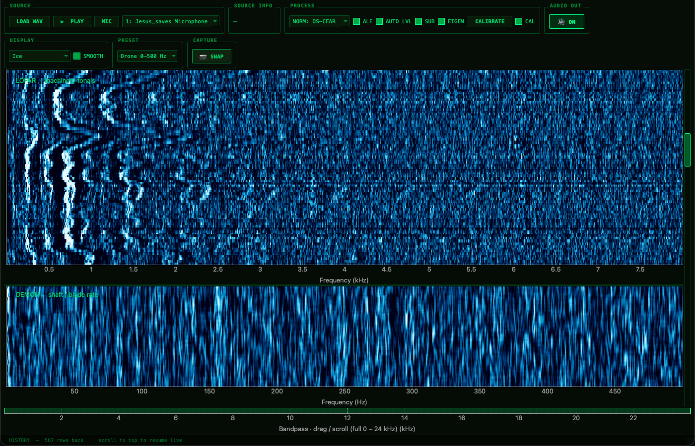

# 🔊 Sonar Station — LOFAR / DEMON

> **A real-time acoustic analysis workstation for anything that makes sound —  
> drones, aircraft, helicopters, ships, HVAC, engines, motors, appliances, wildlife.**

This is not submarine software. The techniques inside — LOFAR and DEMON — were developed for naval sonar, but they work on *any* acoustic signal that carries rotating machinery or periodic structure. If it spins, beats, hums, or pulses, this tool can see it.

It's for anyone who'd rather see a sound than just hear it: hobbyists tracking drones overhead, engineers listening for a bearing that's about to fail, plane-spotters curious what just flew over, or anyone who wants a real sonar waterfall running on their own laptop. It's one file, no build step, no architecture to learn — it's plain PyQt6 widgets end to end — start to finish, you can read the whole thing in an afternoon if you want to know exactly how it works.



---

## What It Does

`sonar_station.py` is a single-file Python desktop application that gives you two live waterfall displays and a configurable bandpass monitor:

| Panel | Technique | What It Reveals |
|---|---|---|
| **LOFAR** | Short-time Fourier transform, normalized | Narrowband tonals — motor frequencies, resonances, structural vibrations |
| **DEMON** | Envelope demodulation of a carrier band | Shaft rate, blade rate, and their harmonics |

Both displays update in real time from a microphone or a WAV file. You can zoom into any frequency band with the scroll wheel, and the bandpass reticule lets you listen to any slice of the spectrum through your speakers.

---

## Installation

```bash
pip install PyQt6 pyqtgraph sounddevice numpy scipy pyfftw
pip install numba  # optional — JIT-compiles OS-CFAR inner loop for extra speed
```

Or, from the required + optional packages listed in `requirements.txt`:

```bash
pip install -r requirements.txt
```

Python 3.10+ recommended. Tested on macOS.

```bash
python sonar_station.py
```

---

## Quick Start

**From a microphone**

1. Launch the app.
2. Select your input device from the dropdown next to the **MIC** button.
3. Press **MIC** to start streaming.
4. The LOFAR waterfall fills with the live spectrum; the DEMON waterfall shows envelope modulation.

**From a WAV file**

1. Press **LOAD WAV** and pick any mono or stereo file.
2. Press **▶ PLAY**.
3. The file loops and both waterfalls update in real time. Stereo files are downmixed to mono for analysis — both channels contribute equally.

---

## Use Cases

Point a microphone at the world and get a live map of everything periodic in it. Exact frequencies depend on your machine's speed, blade count, and geometry — the tool shows you the lines; the physics of your specific case tells you what they mean.

- **🚁 Helicopters & ✈️ Aircraft** — separate main rotor from tail rotor, or propeller from turbine, and watch the lines shift as the aircraft changes speed or attitude.
- **🛸 Drones** — pick out blade-pass tones cleanly even at low signal-to-noise, and tell different makes and models apart by their spectral fingerprint.
- **🚢 Ships & boats** — the classic naval use case: shaft rate and blade rate from a hydrophone or hull-mounted contact mic, with cavitation showing up as broadband noise.
- **🏠 Appliances & HVAC** — catch a failing bearing or an imbalanced motor before it fails outright; a healthy motor holds clean, stable lines, a worn one smears them.
- **🏭 Industrial machinery** — pumps, compressors, gearboxes, conveyors, CNC spindles — anything with a shaft, watched for drift or early fault signs.
- **🌿 Wildlife** — insect and bird wingbeats, wind-turbine blade rates — all resolved as clean lines instead of a fuzzy hum.

See the [Tips](#tips) section below for concrete settings to start from on a few of these.

---

## Controls

| Action | Effect |
|---|---|
| **Scroll wheel on waterfall** | Zoom frequency axis (each panel zooms independently) |
| **Horizontal scroll on waterfall** | Pan frequency axis |
| **Double-click waterfall** | Reset zoom to full range |
| **Drag bandpass reticule edges** | Set analysis/filter band |
| **Scroll wheel on reticule** | Resize the filter band, anchored on the frequency under the pointer (vertical scroll), or pan it (horizontal scroll) |
| **History scrollbar** | Scroll back through waterfall history — top of the bar is always live |
| **NORM dropdown** | Switch normalization algorithm |
| **ALE checkbox** | Toggle adaptive line enhancer |
| **AUTO LVL checkbox** | Adaptive display levels (keeps tonals bright without washing out) |
| **SUB checkbox** | DEMON-only background-noise suppression via multi-sub-band coherent averaging |
| **EIGEN checkbox** | Cross-frame PCA/SVD subspace denoising (LOFAR + DEMON) — sharpens persistent lines, needs NORM on |
| **CALIBRATE button** | Records a few seconds of target-absent audio and builds a dark-frame-style noise calibration |
| **CAL checkbox** | Apply the captured calibration — removes stable interference (hum, self-noise) the other stages can't touch |
| **PRESET dropdown** | One-click frequency-scale presets: Drone 0–500 Hz, Drone 0–1 kHz, Ship 0–200 Hz, LOFAR 0–1/2/4/8 kHz, Full (both) |
| **Color-map dropdown** | Green Phosphor, Night Vision, Amber, Hot, Crimson, Ice, Bone, Copper, Gray, Jet |
| **SMOOTH checkbox** | Bilinear-smooths the waterfall pixels instead of the default sharp/blocky per-bin rendering. Off by default — smoothing blurs adjacent bins together, so the sharp version reads narrowband tonals more precisely. Effect is subtle at full zoom-out (bin count roughly matches screen pixels) and becomes clearly visible once you zoom into a narrower band |
| **📷 SNAP button** | Saves a screenshot (`sonar_station_YYYY-MM-DD_HH-MM-SS.png`) to the current working directory |

Audio output through your speakers plays the bandpass-filtered signal from the reticule band — useful for listening to the frequency slice you're analyzing.

---

## Signal Processing

For anyone who wants to dig into how it actually works — the heavy lifting is done by a handful of algorithms that run in a background thread, leaving the GUI smooth.

**LOFAR — narrowband tonal detection**  
Each audio chunk is anti-alias-filtered and decimated to 16 kHz, then a 4096-point FFT is computed over a Hanning-windowed ring buffer. The ring buffer approach means the frequency resolution is always `sample_rate / FFT_N ≈ 3.9 Hz/bin` regardless of the chunk size. The spectrum is then normalized by one of four methods before being drawn as a waterfall row.

**DEMON — shaft and blade-rate detection**  
The audio is bandpass-filtered to the carrier band you set with the reticule, then full-wave-rectified to extract the amplitude envelope. The envelope is low-pass-filtered and decimated to ~2 kHz, giving a Nyquist of 1 kHz — enough to capture blade rates from slow ship screws to fast drone rotors. A 4096-point FFT of the envelope produces the DEMON waterfall. Bin width is ≈ 0.49 Hz (2000 Hz / 4096), so even closely-spaced shaft lines are resolved.

**ALE — Adaptive Line Enhancer**  
An optional frequency-domain LMS filter (FDAF) that whitens broadband noise and sharpens tonal lines before they reach the FFT. Useful when background noise is high. Toggle with the ALE checkbox.

**Normalization**

| Mode | What it does | Best for |
|---|---|---|
| **Off** | Median-subtracted raw dB | Unprocessed reference |
| **TPSW** | Two-pass split-window (classic sonar) | Moderate tonal density |
| **Robust** | Percentile-based floor | High tonal density, fast |
| **OS-CFAR** | Ordered-statistic CFAR with guard cells | Best isolation of strong lines |

**EIGEN — cross-frame PCA/SVD subspace denoiser**  
Everything above estimates the noise floor from a single frame — it only looks *across frequency*. EIGEN looks *across time* instead: it keeps a rolling window of the last 24 floor-normalized frames (LOFAR and DEMON each have their own), factors that window with an SVD every few frames, and reconstructs each new spectrum from only its top 4 eigen-spectra.

A persistent tonal occupies the same bin frame after frame, so it's almost entirely captured by those leading components; noise that's incoherent from one frame to the next is spread across the rest and gets dropped.

It's a genuine complement to TPSW/Robust/OS-CFAR rather than a replacement — needs one of those active (no effect on NORM: Off) and trades away very weak or short-lived tonals in exchange for markedly cleaner strong, stable lines. Toggle with the EIGEN checkbox.

**CAL — dark-frame-style noise calibration**  
TPSW / Robust / OS-CFAR / EIGEN all estimate the noise floor from the live signal itself — which is exactly why they preserve narrowband tonals; a real target line and a "floor outlier" look the same to a self-referential estimator. CAL is different: it's the audio equivalent of an astronomical dark frame.

Hit **CALIBRATE** while the target is absent but everything else is identical (same gain, same mic, same environment, same NORM mode) and it records a few seconds of the *normalized* spectrum (LOFAR and DEMON each have their own), combines those frames with a sigma-clipped mean (the same combine method used for real master darks — it rejects a stray transient during capture without throwing away as much data as a plain median would), and builds a master excess-ratio profile.

With **CAL** switched on (it arms itself automatically once capture finishes), that master is divided out of every future frame right after NORM runs — a bin that sat at the floor during calibration is re-centered to a master of ~1.0 so nothing happens to it, while a bin that was itself elevated then gets pulled back down. The re-centering step matters: a normalizer's own "typical" output isn't necessarily 1.0 (OS-CFAR at its default rank, for instance, puts most ordinary bins measurably *below* 1.0 by construction), so without it, dividing by the raw master would rescale every bin uniformly — background included — which is the "noise got brighter" failure mode this step exists to prevent.

A bin's own measurement carries some scatter just from a short capture, even with zero real interference there — so the correction is only applied where a bin's excess is statistically distinguishable from that scatter; everything else is left as an exact no-op rather than nudged by whatever noise happened to occur during that one capture.

It has to work this way, on the *normalized* ratio rather than the raw spectrum: a normalizer's output is already a ratio to its own freshly-recomputed local floor, so subtracting anything from the raw magnitude before it runs gets largely undone by that same re-division — worse, it inflates the ratio of anything that wasn't part of the calibration, since the local floor computed around it shrinks too. Operating on the ratio sidesteps that entirely.

Because it comes from an actual measurement rather than an assumption about spectral shape, CAL is the only stage here that can knock out stable narrowband interference that looks exactly like a tonal: mains hum and its harmonics, ground-loop buzz, a fixed self-noise spur in the audio interface. The same caveat applies as with a real dark frame: it only helps for interference that's present independent of your target — calibrate against the wrong reference and you divide out your own signal, not just the noise. Needs a NORM mode other than Off to calibrate against, and switching NORM modes clears it, since it's calibrated to that mode's specific scale.

---

## Zoom and Resolution

When you scroll to zoom into a narrow frequency range, the app automatically grows the FFT window to maintain true resolution improvement (not just interpolation). At 10× zoom the effective bin width narrows by 10×, resolving lines that would otherwise merge. This uses SciPy's `ZoomFFT` (Chirp Z-transform) over a ring buffer sized to `8 × FFT_N` samples.

---

## Color Maps

| Map | Character |
|---|---|
| Green Phosphor | Classic green-screen look |
| Night Vision | Higher contrast, deeper blacks |
| Amber | Warm orange — low eye strain |
| Hot | Black → red → yellow → white |
| Crimson | High-urgency red |
| Ice | Deep blue → cyan → white |
| Bone | Cool blue-grey, subtle |
| Copper | Black → brown → pale yellow |
| Gray | Pure grayscale |
| Jet (analysis) | Rainbow — familiar from MATLAB |

---

## Dependencies

| Package | Role | Required |
|---|---|---|
| `PyQt6` | GUI framework | ✅ |
| `pyqtgraph` | Real-time waterfall rendering | ✅ |
| `sounddevice` | Mic input and audio output | ✅ |
| `numpy` | Array math | ✅ |
| `scipy` | Filters, FFT, ZoomFFT | ✅ |
| `pyfftw` | FFTW-backed FFT (faster) | optional |
| `numba` | JIT-compiled OS-CFAR loop | optional |

---

## Tips

- **Drones**: zoom the LOFAR display to 2 000 – 6 000 Hz to isolate the motor harmonic tones. Also set the bandpass reticule (DEMON carrier band) to that same range — DEMON then demodulates the blade-pass frequency from the carrier and shows it as a bright line in the 0 – 500 Hz DEMON panel. Or just use the **Drone 0–500 Hz** preset.
- **HVAC / appliances**: plug a phone recording in as a WAV. Set NORM to **Robust** to suppress the room noise floor.
- **Ships / outboards**: use a hydrophone or a contact mic on a hull, feed the signal into your audio interface, and the app works identically.
- **Aircraft at distance**: a directional mic improves SNR dramatically. Enable ALE to whiten wind noise before the FFT.
- **Multiple mics**: if you have a matched stereo pair both aimed at the same source, the mono downmix averages two uncorrelated noise floors while the on-axis signal adds coherently — a genuine ~3 dB SNR improvement. A single mic in one channel of a two-channel interface gives you nothing extra; the empty channel contributes only noise to the average.
- **Factory machinery**: mount an accelerometer with a contact-mic adapter on a bearing housing. The LOFAR waterfall will show the bearing characteristic frequencies as steady horizontal lines; defect sidebands appear symmetrically around the shaft-rate harmonic.
- **Persistent hum or a fixed background tone** (mains hum, a ground loop, an always-on fan/HVAC drone): before your target shows up, hit **CALIBRATE** and hold still for the countdown — it needs the target absent and everything else exactly as it will be during real monitoring (same gain, same environment). That's the one stage here that can remove a stable, tonal-looking interferer the other normalizers are specifically designed to preserve.

---

## Device Disconnection

If your audio interface is unplugged while streaming, the app stops cleanly and shows a message in the status bar. Restart the application to reconnect — PortAudio on macOS does not reliably recover a lost USB audio session in place.

---

## License

MIT — do whatever you want with it.
